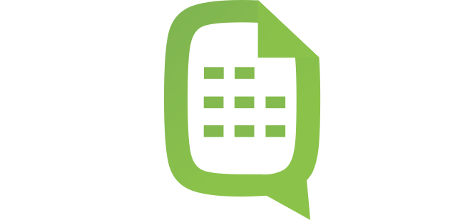

<h1 align="center" >

 TablesGPT

</h1>

<b>TablesGPT</b> is a powerful and versatile open-source application that allows users to extract, organize, analyze, and visualize tabular data from files using natural language commands.

<h4 style="font-family: Monospace">To Do:</h4>

- [ ] Finalize v1 of Project Roadmap  
- [ ] Commit first project files to repository  
- [ ] Create project Discord server   
- [ ] Create project collective for fundraising on [Open Collective](https://opencollective.com/)

<h3 style="font-family: Monospace">Join Our Discord</h3>

<h3 style="font-family: Monospace">Getting Started</h3>

<h3 style="font-family: Monospace">Supporting TablesGPT</h3>

If you would like to support the project financially, visit our campaign on [OpenCollective](). Your contributions help accelerate the development of TablesGPT!

<h3 style="font-family: Monospace">Interested in Contributing?</h3>

Please consider contributing to our community-driven project and help shape the future of productivity applications.

1. Read the [Code of Conduct](https://www.contributor-covenant.org/)  
2. Read the [Contributing Guidelines]()  