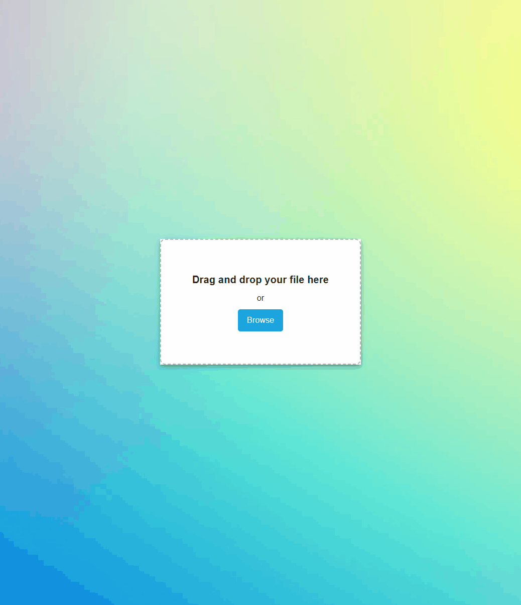

<h1 align="center" >

<br >TablesGPT
</h1>

<div align="center">

[](code_of_conduct.md) 

</div>

<p><b>TablesGPT</b> is a powerful and versatile open-source application that allows users to extract, organize, analyze, and visualize tabular data from files using natural language commands.
</p>

<div align="center">


<i>Data Extraction</i>
</div>

## Features Roadmap


### Extract

- [x] <b>PDF Table Extraction:</b> Enable users to efficiently extract structured tabular data from PDF documents. The implementation will be designed to handle varying table formats, with the capability to accurately identify and parse data from both simple and complex table structures.<br>

### Transform

- [ ] <b>Natural Language Table Transformation:</b>  Enable users to manipulate and transform tabular data using natural language commands. TablesGPT will be able to interpret and execute a variety of data operations, such as filtering, sorting, and aggregating, based on user-provided text instructions. 

### Export
- [ ] <b>SQL Query Export: </b> Provide users with the ability to generate SQL queries tailored for inserting the generated JSON data into their preferred database system.

## Getting Started
### Setting  your OpenAI API Key
1️⃣ Navigate to the `apis` directory 
2️⃣ Update the `.env` file with your OpenAI API key.

### Starting the React Frontend
1️⃣ Navigate to the `frontend` directory:
```bash
$ cd frontend
```
2️⃣ Install the required dependencies (if you haven't already):
```bash
$ npm install
```
3️⃣Start the React frontend:
```bash
$ npm start
```

### Starting the Flask API
1️⃣ Navigate to the `apis` directory:
```bash
$ cd apis
```
2️⃣ Install the required dependencies (if you haven't already):
```bash
$ python -m pip install -r requirements.txt
```
3️⃣ Run the Flask API server:
```bash
$ python app.py
```

### Interested in Contributing?
We welcome and appreciate any contributions to our community-driven project. Our goals are to enhance the accessibility and usability of tabular data manipulation, and to make it significantly easier for users with limited technical expertise to interact with and analyze complex datasets. 🚀

#### Types of Contributions
Discussions, bug reports, issues, and pull requests are all welcome. If you're interested in contributing through pull requests, please follow the guidelines below.

#### Pull Request Guidelines

* Review [Issues](https://github.com/lightshifted/TablesGPT/issues) and [Pull Requests](https://github.com/lightshifted/TablesGPT/pulls) before submitting your own.
* Fork the repository and create your branch from the master branch.
* Make sure your code is well-documented, easy to understand, and readable.
* Provide a clear and concise description of the changes made in the pull request.
* Ensure that your pull request has a descriptive title and a reference to the relevant issue(s).
* Be responsive and open to feedback and suggestions from the community.
* Please be patient, as we have a small team at the moment and only one person reviewing the pull requests.
